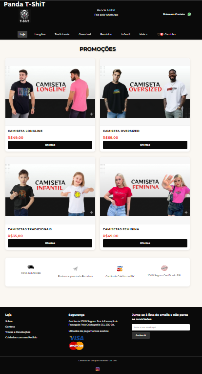

<p align="center">
  
</p>

<h1 align="center">🛍️ Panda T-Shirt - Catálogo Web</h1>

<p align="center">
  Um site moderno e responsivo desenvolvido para funcionar como catálogo digital de produtos.
</p>

---

## 🖥️ Sobre o Projeto

Este projeto é um **site catálogo** ideal para lojas de roupas, acessórios ou pequenos negócios que desejam apresentar seus produtos online de forma simples, elegante e eficiente.

✔️ Interface limpa e organizada
✔️ Estrutura leve e rápida
✔️ Fácil de personalizar
✔️ Pronto para hospedagem no GitHub Pages

---

## ✨ Funcionalidades

* 📦 Exibição de produtos em formato de catálogo
* 🏷️ Preços e informações visuais
* 🔘 Botões de ação (ex: ofertas, detalhes, etc.)
* 📱 Design responsivo (funciona no celular)
* ⚡ Navegação simples e direta

---

## 🔎 Tecnologias Utilizadas

* HTML5
* CSS3
* JavaScript
* Git e GitHub

---

## 🌐 Demonstração

👉 Acesse o projeto online:
🔗 **(coloque aqui o link do GitHub Pages depois)**

---

## 🎨 Layout

O design foi pensado para ser moderno e adaptável a diferentes tipos de lojas.

---

## 💼 Ideal Para

Este projeto pode ser utilizado como:

* Catálogo de roupas 👕
* Loja simples online 🛒
* Portfólio de produtos 📦
* Página de vendas básica 💰

---

## 📌 Como Usar

1. Clone o repositório:

```bash
git clone https://github.com/MarcilioGiT?tab=repositories
```

2. Abra o arquivo `index.html` no navegador

3. Edite os produtos facilmente no código

---

## 🧑‍💻 Autor

Desenvolvido por **Marcilio** 🚀
📩 Entre em contato para projetos e freelas

---

## ⭐ Destaque

Se você está procurando um site simples e eficiente para apresentar produtos, esse projeto é uma ótima base para começar.
